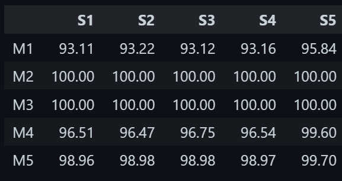

# Sampling Assignment – Credit Card Fraud Detection

## Objective
The objective of this assignment is to analyze the effect of different sampling techniques on various machine learning models when dealing with a highly imbalanced dataset.

---

## Dataset Description
The dataset consists of credit card transactions where the target variable `Class` indicates whether a transaction is fraudulent or not.

- Class 0: Normal transaction  
- Class 1: Fraudulent transaction  

The dataset is highly imbalanced, with fraudulent transactions being extremely rare.

---

## Data Preprocessing
- The dataset was loaded and explored using Pandas.
- No missing values were found.
- All features are numerical.
- Feature scaling was applied using **StandardScaler**.
- Dataset balancing was performed using **SMOTE (Synthetic Minority Over-sampling Technique)**.

After applying SMOTE, both classes had equal representation.

---

## Sampling Techniques Used

| Sampling ID | Sampling Technique |
|------------|-------------------|
| S1 | Random Under Sampling |
| S2 | Random Over Sampling |
| S3 | SMOTE |
| S4 | Tomek Links |
| S5 | SMOTEENN |

---

## Machine Learning Models Used

| Model ID | Model |
|--------|------|
| M1 | Logistic Regression |
| M2 | Decision Tree |
| M3 | Random Forest |
| M4 | K-Nearest Neighbors |
| M5 | Support Vector Machine |

---

## Experimental Methodology
- The balanced dataset was divided into **five different samples**.
- Each sampling technique was applied to each model.
- Accuracy was calculated to compare performance.
- Evaluation was done on the resampled dataset to observe the impact of sampling techniques.

---

## Accuracy Results

| Model | S1 | S2 | S3 | S4 | S5 |
|------|----|----|----|----|----|
| M1 | 93.11 | 93.22 | 93.12 | 93.16 | 95.84 |
| M2 | 100.00 | 100.00 | 100.00 | 100.00 | 100.00 |
| M3 | 100.00 | 100.00 | 100.00 | 100.00 | 100.00 |
| M4 | 96.51 | 96.47 | 96.75 | 96.54 | 99.60 |
| M5 | 98.96 | 98.98 | 98.98 | 98.97 | 99.70 |

---

## Analysis and Discussion
- Tree-based models such as **Decision Tree (M2)** and **Random Forest (M3)** achieved 100% accuracy across all sampling techniques.
- This behavior indicates **overfitting**, as these models can perfectly memorize the resampled training data.
- Logistic Regression showed stable performance but lower accuracy due to its linear nature.
- KNN and SVM benefited from oversampling techniques, achieving high accuracy with SMOTE and SMOTEENN.
- Sampling techniques significantly influence model performance, and their impact varies across models.

---

## Conclusion
This experiment demonstrates that handling class imbalance is crucial in fraud detection tasks. While sampling techniques improve performance, model selection plays an equally important role. Ensemble and tree-based models are highly sensitive to overfitting when trained on resampled data.

---

## Technologies Used
- Python
- Pandas
- NumPy
- Scikit-learn
- Imbalanced-learn
- Jupyter Notebook
- VS Code

---

## Repository Structure
